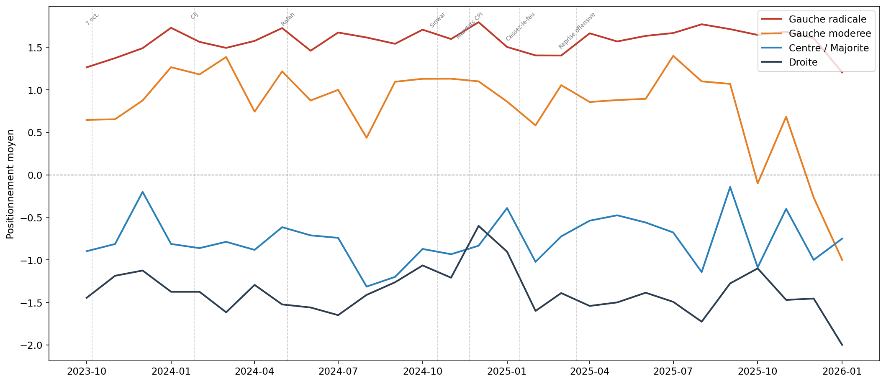

# 🇫🇷 Discours parlementaire français sur Gaza (2023–2026)

[](LICENSE)
[](requirements.txt)
[]()
[]()

Analyse computationnelle du discours de **459 députés** sur **10 774 textes** (tweets et interventions à l'Assemblée nationale) entre octobre 2023 et janvier 2026. Annotation de stance, analyse de cadrage, méthodes de science politique computationnelle.

---

## Résultat phare



*Stance mensuel par bloc politique (oct. 2023 – janv. 2026). IC 95 %. Le Centre varie fortement après les événements pivot ; Gauche radicale et Droite restent stables.*

---

## Résultats principaux

| Résultat | Figure |
|----------|--------|
| Le Centre réagit, les extrêmes restent stables | [fig10](figures/fig10_stance_ribbon.png) |
| Paradoxe de la Droite au cessez-le-feu (Δ stance -1,03, p≈0,008) | [fig12](figures/fig12_diff_in_diff.png) |
| Convergence transpartisane tardive (G.mod 35,5 %, Centre 30,3 %) | [fig33](figures/fig33_convergence_batch.png) |
| Polarisation lexicale Gauche radicale / Droite | [fig18](figures/fig18_distance_cosinus_gr_droite.png) |
| Variables batch-spécifiques (condemns_hamas, genocide_framing...) | [fig28](figures/fig28_variables_batch.png) |

Voir [Catalogue des figures](docs/CATALOGUE_FIGURES.md) pour la liste complète (fig01–fig50).

---

## Reproduction

```bash
python -m venv .venv && .venv\Scripts\activate
pip install -r requirements.txt
python src/prepare_data.py
python scripts/run_analysis.py
```

Le corpus (`corpus_v3.parquet`, `corpus_v4.parquet`) doit être placé dans `data/processed/` — ou copié via `prepare_data.py` si le projet source est voisin. Variable d'environnement : `GAZA_SOURCE_PROJECT`.

Le script produit CSV dans `data/results/`, figures dans `figures/`, rapport dans `data/results/RAPPORT_RESULTATS.txt`.

---

## Méthodologie

| Étape | Méthode |
|-------|---------|
| Annotation stance | Échelle -2 à +2, accord v3↔v4 : Spearman 0,86 |
| Segmentation | 7 batches (CHOC → NEW_OFFENSIVE), cf. [METHODOLOGIE.md](docs/METHODOLOGIE.md) |
| Event studies | Shift temporel avant/après, Mann-Whitney |
| Polarisation | Distance cosinus, log-odds (Monroe et al. 2008) |

**Limites :** pas de validation humaine systématique ; corpus déséquilibré par bloc ; aucune inférence causale stricte.

**Documentation :** [METHODOLOGIE.md](docs/METHODOLOGIE.md), [CODEBOOK.md](docs/CODEBOOK.md), [DONNEES.md](docs/DONNEES.md), [METHODES_COMPLEMENTAIRES.md](docs/METHODES_COMPLEMENTAIRES.md).

---

## Structure

```
├── scripts/    # run_analysis.py (script unique)
├── notebooks/  # 01–10 : reproductibles
├── src/        # config, prepare_data, vad_lexicon, mfd_lexicon, registre_discursif, validation_humaine, validation_metrics
├── data/results/
├── figures/
└── docs/       # METHODOLOGIE.md, CODEBOOK.md, DONNEES.md, METHODES_COMPLEMENTAIRES.md
```

---

## Livrables

- **Brief analytique** : [reports/brief_analytique.md](reports/brief_analytique.md) (8 pages, figures clés)
- **Validation humaine** : `python src/validation_humaine.py` → annotation → `python src/validation_metrics.py`

---

## Licence

MIT © 2026
