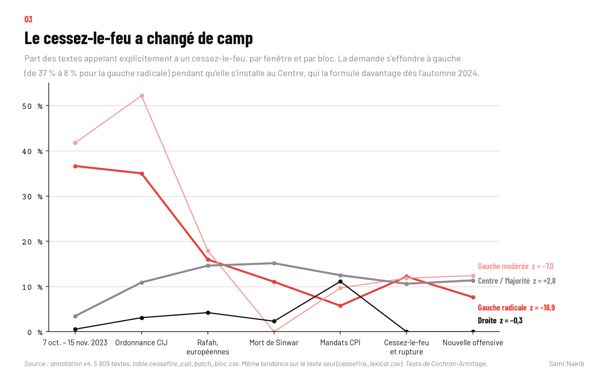

# Les députés français face à la guerre à Gaza

Analyse de ce que les députés français ont dit du conflit israélo-palestinien, sur X et en séance, avant et après le 7 octobre 2023.

Le corpus principal compte 10 774 textes (9 135 tweets, 1 639 interventions en séance) publiés par 332 députés entre octobre 2023 et janvier 2026, annotés par un modèle de langage. Un second corpus de 4 099 interventions en séance couvre juillet 2022 à juin 2024 et permet de comparer l'avant et l'après.

## Résultats principaux

Des positions figées, des cadrages mobiles. Aucun bloc ne change de camp sur la période, et le clivage était déjà en place lors d'un débat parlementaire de mai 2023. Ce qui bouge, ce sont les composantes du discours : la demande de cessez-le-feu quitte la gauche pour le Centre, la gauche passe de la demande à la qualification, et la droite, puis le Centre, font de Gaza une affaire de politique intérieure. L'attention retombe après octobre 2023 et se concentre : vingt personnes produisent la moitié des textes.

Le détail, avec le niveau de solidité de chaque résultat, est dans [docs/resultats.md](docs/resultats.md).



## Avertissement méthodologique

Le modèle d'annotation connaissait le groupe politique de l'auteur de chaque texte. Les mesures qui reposent sur son jugement (position, registre émotionnel) peuvent refléter l'étiquette partisane autant que le contenu. Les résultats principaux reposent sur des mesures qui n'ont pas ce défaut : comptages, mots présents dans le texte, informations factuelles extraites. La validation humaine des positions reste à faire ([docs/validation.md](docs/validation.md)).

## Organisation

| Dossier | Rôle |
|---|---|
| `collecte/` | Collecte des comptes rendus de séance et des tweets |
| `annotation/` | Prétraitement et annotation par modèle de langage (v3, v4) |
| `analyse_corpus/` | Deux chaînes de mesures sur le corpus annoté, qui ont produit les tables de `data/resultats/` |
| `analyse/` | Analyse secondaire reproductible à partir des tables et des interventions 2022-2024 |
| `data/` | Tables de résultats, interventions 2022-2024, échantillon de validation |
| `sorties/` | Tables, chiffres clés et figures produits par `analyse/` |
| `docs/` | Méthodologie, résultats, données, codebook, validation, charte graphique |

## Reproduire

```
python -m venv .venv
source .venv/bin/activate
pip install -r requirements.txt
python -m analyse
```

La commande écrit les tables dans `sorties/tables/`, les chiffres cités dans `sorties/chiffres_cles.md` et les figures dans `sorties/figures/`. Le corpus annoté d'origine n'étant plus disponible, les chaînes de `analyse_corpus/` ne peuvent pas être réexécutées ; leur code documente la production des tables (`docs/donnees.md`).

## Documentation

- [Méthodologie](docs/methodologie.md) : question, cadre d'analyse, hypothèses, mesures, limites
- [Résultats](docs/resultats.md)
- [Données](docs/donnees.md) et [manifeste des tables](data/resultats/MANIFESTE.csv)
- [Codebook](docs/codebook.md)
- [Validation humaine](docs/validation.md)

## Licence

Code sous licence MIT. Les comptes rendus de l'Assemblée nationale sont diffusés sous Licence ouverte.

Sami Nakib, 2026.
