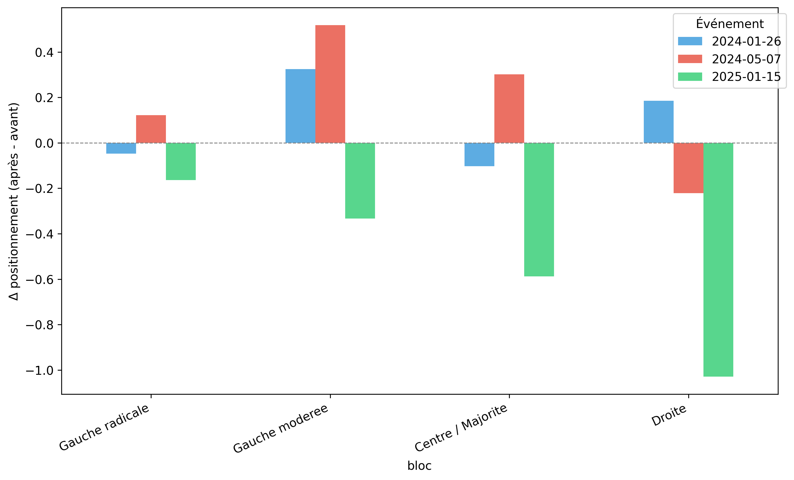
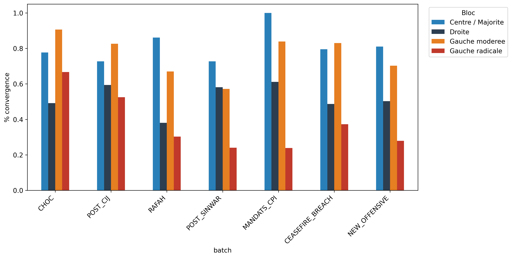
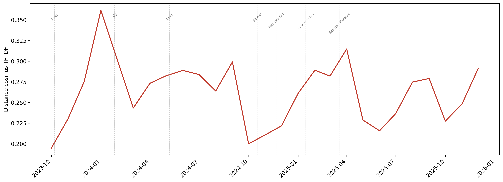

# Brief analytique — Discours parlementaire français sur Gaza (2023–2026)

---

## 1. Contexte et question de recherche

Entre octobre 2023 et janvier 2026, le conflit israélo-palestinien a mobilisé une part significative du discours politique français. Ce projet analyse **10 774 textes** produits par **459 députés** (tweets et interventions à l'Assemblée nationale) pour caractériser l’évolution des positionnements discursifs selon les blocs politiques et les événements pivot (CIJ, mandats CPI, cessez-le-feu, etc.).

**Question centrale :** Comment les blocs politiques réagissent-ils discursivement aux événements ? Le Centre est-il plus réactif que les extrêmes ?

---

## 2. Données et méthode

- **Corpus :** Tweets (9 135) et interventions en séance (1 639), collectés et annotés.
- **Annotation :** LLM (score stance -2 à +2), accord inter-versions élevé (Spearman 0,86).
- **Blocs :** Gauche radicale, Gauche modérée, Centre / Majorité, Droite (LR+RN).
- **Méthode :** Event studies (shift temporel avant/après), distance cosinus, fighting words (Monroe et al.), convergence lexicale vers le vocabulaire du cessez-le-feu.

---

## 3. Résultat 1 — Stabilité vs réactivité

**Le Centre réagit, les extrêmes restent stables.** Sur 28 mois, seul le Centre varie significativement après les événements pivot (CIJ, mandats CPI, cessez-le-feu, rupture). La Gauche radicale et la Droite maintiennent des positions discursives quasi fixes.

---

## 4. Résultat 2 — Paradoxe de la Droite

**Réaction paradoxale au cessez-le-feu :** Quand le Centre appelle au cessez-le-feu (janv. 2025), la Droite durcit son discours (Δ stance ≈ -1,03, p≈0,008). Interprétation : stratégie de différenciation — la Droite se distingue en radicalisant sa position.

---

## 5. Résultat 3 — Convergence transpartisane

**Convergence tardive vers le vocabulaire du cessez-le-feu :** En fin de période, 35,5 % des textes Gauche modérée et 30,3 % des textes Centre adoptent le lexique du cessez-le-feu. La diffusion lexicale suit les positions implicites — le Centre converge plus que la Droite.

---

## 6. Résultat 4 — Polarisation lexicale

**Distance cosinus maximale en décembre 2024** entre Gauche radicale et Droite. Les « fighting words » (log-odds par bloc) distinguent nettement les vocabulaires : lexique de la condamnation vs lexique de la légitimité.

---

## 7. Limites et perspectives

- Pas de validation humaine de l’annotation LLM.
- Corpus déséquilibré (Gauche radicale ≈ 63 %).
- Aucune inférence causale stricte — associations observées.
- **Pistes :** validation humaine, corpus équilibré, granularité LR/RN.

---

## 8. Annexe méthodologique

Fenêtres temporelles (batches) : CHOC → POST_CIJ → RAFAH → POST_SINWAR → MANDATS_CPI → CEASEFIRE_BREACH → NEW_OFFENSIVE. Voir [METHODOLOGIE.md](../docs/METHODOLOGIE.md) et le dépôt GitHub pour le code complet.
